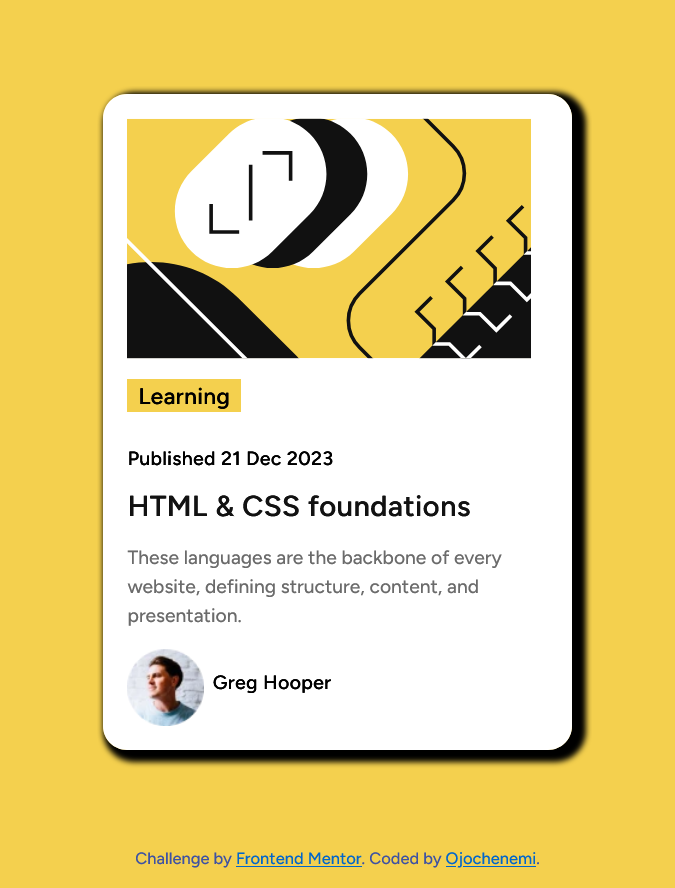

# Frontend Mentor - Blog preview card solution

This is a solution to the [Blog preview card challenge on Frontend Mentor](https://www.frontendmentor.io/challenges/blog-preview-card-ckPaj01IcS).

## Table of contents

- [Overview](#overview)
  - [The challenge](#the-challenge)
  - [Screenshot](#screenshot)
  - [Links](#links)
- [My process](#my-process)
  - [Built with](#built-with)
  - [What I learned](#what-i-learned)
  - [Continued development](#continued-development)
- [Author](#author)

## Overview

### The challenge

Users should be able to:

- See hover and focus states for all interactive elements on the page

### Screenshot

here is the path to my screenshot.
"C:\Users\HP\Downloads\Screenshot 2025-02-23 at 10-51-16 Frontend Mentor Blog preview card.png"

### Links

- Solution URL: [Github repository](https://github.com/Iamojochenemi/blog-preview-card.git)
- Live Site URL: [github.io](https://iamojochenemi.github.io/blog-preview-card/)

## My process

### Built with

- Semantic HTML5 markup
- CSS custom properties
- Flexbox

### What I learned

I learned how to apply box shadows effectively, also learnt how to apply hsl color effects

### Continued development

i'd like to focus on learning alot more CSS, and other related aspects

## Author

- Frontend Mentor - [@Iamojochenemi](https://www.frontendmentor.io/profile/Iamojochenemi)
- Twitter - [@therealchenemi](https://www.twitter.com/therealchenemi)
